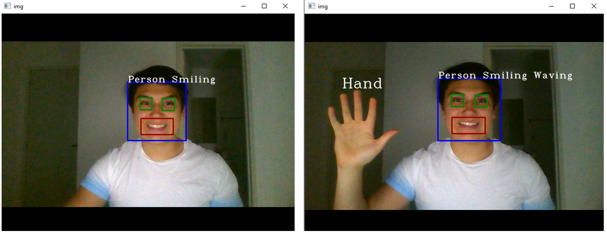

# Emotion detection
Computer vision program for emotion detection

The following program uses computer vision to analyze facial features and determine the emotional status of the user. 

### Requirements
- Python 3.7.6
- OpenCV
- Cuda compatible card (_Min. recommendation: Gtx 1060_)
- Webcam 720p or superior

### Solution
The program uses a group of CascadeClassifiers to determine the present facial features. An algorithm checks the combinations of behaviours of the facial features to output an emotional status

_**The program is currently on development and push requests are welcome to improve the project**_
